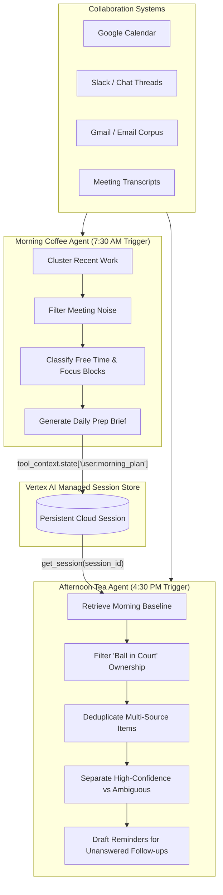

# Autonomous Workday Reconciliation Agents
**Morning Coffee & Afternoon Tea Production Architecture**

---

## Executive Summary

On Glean, the workday is split into two distinct, autonomous agent moments:
1. **Morning Coffee (Plan)**: A daily prep agent designed to run each morning (~7:30 AM – 8:30 AM) to synthesize recent activity, top project deadlines, and high-signal meetings into a lightweight execution brief.
2. **Afternoon Tea (Reconcile)**: A late-day action review agent designed to run before logoff (~3:30 PM – 5:00 PM) to scan collaboration channels, reconcile completed vs. open tasks, filter strictly for user ownership, and draft follow-up reminders.

Rather than maintaining a real-time network connection (A2A REST/SSE), this architecture **decouples the two moments** into sovereign Vertex AI Agent Engine (`agent_engine`) deployments. State handoff is performed asynchronously using **Shared User-Persistent State (`VertexAiSessionService`)**.

---

## 1. High-Level Architecture & Execution Flow



---

## 2. Decoupled State Handoff Protocol

### The `"user:"` State Prefix Pattern
By default, keys stored in ADK's `tool_context.state` are transient and bound to the immediate conversation turn. Prefixing keys with `"user:"` elevates them to persist across distinct invocations for that `user_id` inside Vertex AI's managed session backend (`reasoningEngines/.../sessions/...`).

#### Morning Producer (`morning-agent`)
```python
def publish_morning_plan(plan_details: str, tool_context: ToolContext) -> dict:
    """Saves the Morning Coffee prep details to session storage."""
    tool_context.state["user:morning_plan"] = plan_details
    return {"status": "success", "saved": True}
```

#### Afternoon Consumer (`afternoon-agent`)
```python
async def retrieve_morning_plan(session_key: str, tool_context: ToolContext) -> dict:
    """Retrieves the morning baseline plan via Vertex AI Session Service."""
    session_service = VertexAiSessionService()
    morning_session = await session_service.get_session(
        app_name="morning-agent",
        user_id=tool_context.session.user_id,
        session_id=session_key,
    )
    plan = morning_session.state.get("morning_plan") if morning_session else None
    return {"status": "success", "morning_plan": plan}
```

---

## 3. Agent Profiles & Tool Specifications

### Morning Coffee Agent
* **Runtime**: Managed Reasoning Engine (`8298902660220715008`).
* **Noise Filtering**: Explicitly strips out commute blocks, solo focus blocks, tentative meetings, and declined invitations.
* **Core Tools**:
  1. `search_recent_work(query)`: Clusters active repositories and ranks urgency by deadline and stakeholder impact.
  2. `get_calendar_events(date_str)`: Retrieves validated meetings for prep generation.
  3. `schedule_focus_time(duration)`: Generates "Book it now" Google Calendar links for usable micro/deep-work blocks.
  4. `publish_morning_plan(details)`: Commits today's priority context to the session store.

### Afternoon Tea Agent
* **Runtime**: Managed Reasoning Engine (`3301595923699728384`).
* **Ownership Filtering**: Aggressively filters out external dependencies ("waiting on customer signoff"). Only includes tasks where the "ball is in the user's court."
* **Core Tools**:
  1. `retrieve_morning_plan(key)`: Ingests the morning baseline context.
  2. `scan_collaboration_activity(timeframe)`: Scans Zoom transcripts, Slack threads, and outbound emails.
  3. `filter_ball_in_court(signals)`: Deduplicates repeated tasks (e.g., Zoom call + Slack thread) and drafts follow-up reminders.

---

## 4. Production Deployment & Verification

### Remote Deployment (`make deploy`)
Both agents are deployed as containerized cloud endpoints with dynamic method binding:

```bash
# Deploy Morning Coffee
cd morning-agent && make deploy

# Deploy Afternoon Tea
cd afternoon-agent && make deploy
```

### Verification Suite (`make eval`)
Evaluated under ADK's LLM-as-Judge rubric verification framework (`safety_v1` and response relevance):

```bash
make eval EVALSET=tests/eval/evalsets/workday.evalset.json
```
